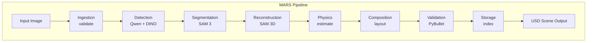
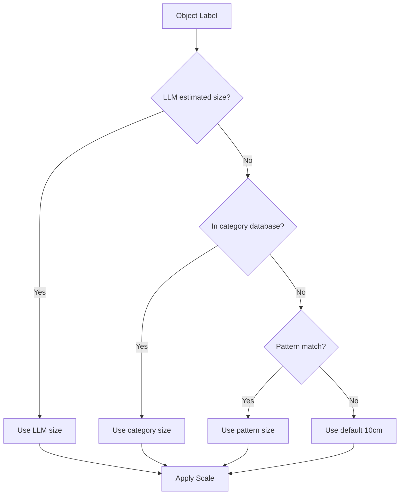
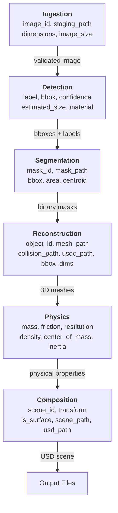
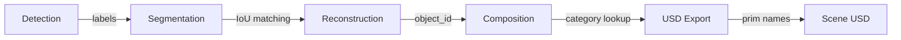
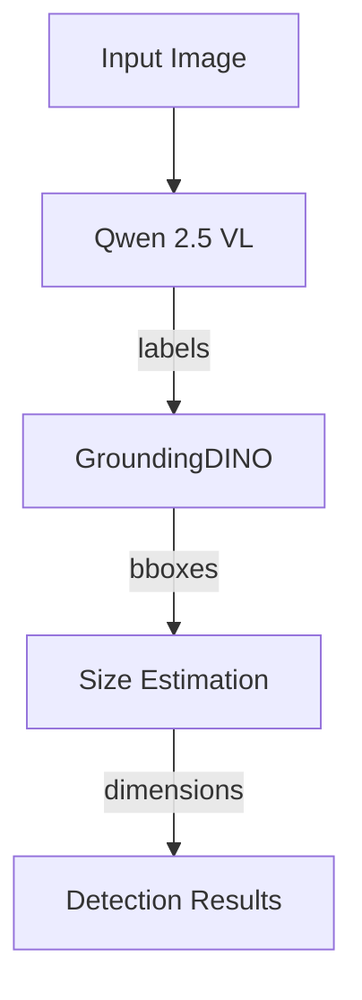
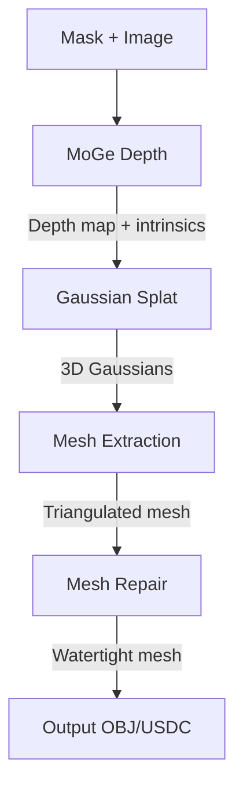
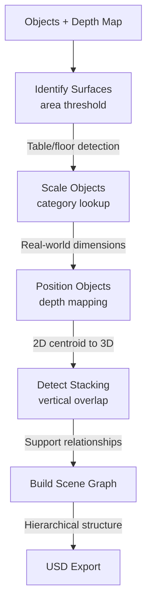

# MARS Architecture and Design

This document describes the architecture, design decisions, intended uses, and limitations of the MARS pipeline.

---

## Table of Contents

1. [Overview](#overview)
2. [System Architecture](#system-architecture)
3. [Pipeline Stages](#pipeline-stages)
4. [Data Flow](#data-flow)
5. [Component Details](#component-details)
6. [Model Dependencies](#model-dependencies)
7. [Use Cases](#use-cases)
8. [Limitations](#limitations)
9. [Known Issues](#known-issues)
10. [Future Work](#future-work)

---

## Overview

MARS transforms 2D images into Isaac Sim-ready 3D scenes. The pipeline performs:

1. Object detection from images using vision-language models
2. Precise segmentation using SAM (Segment Anything Model)
3. Single-view 3D reconstruction using SAM 3D Objects
4. Scene composition with physics properties
5. Export to USD format for robot simulation

### Design Goals

- **Automation**: Minimal manual intervention required
- **Accuracy**: Correct object identification, scaling, and spatial relationships
- **Simulation-Ready**: Output directly usable in Isaac Sim with physics
- **Extensibility**: Modular architecture allowing component replacement

### Target Output

A USD scene file containing:
- Individual 3D meshes with vertex colors
- Collision meshes for physics simulation
- Physics properties (mass, friction, restitution)
- Correct real-world scaling
- Proper spatial arrangement

---

## System Architecture

### High-Level Architecture



### Module Structure

```
src/mars/
    pipeline.py              # Main orchestrator
    
    ingestion/               # Stage 1: Image validation
        ingest.py
        
    detection/               # Stage 2: Object detection
        hybrid.py            # Qwen2-VL + GroundingDINO
        qwen_direct.py       # Qwen-only alternative
        base.py              # Base classes
        factory.py           # Model instantiation
        
    segmentation/            # Stage 3: Mask generation
        sam3.py              # SAM 3 with text prompts
        sam2.py              # SAM 2 fallback
        segment.py           # Flow orchestration
        
    reconstruction/          # Stage 4: 3D mesh generation
        sam3d.py             # SAM 3D Objects wrapper
        flow.py              # Reconstruction flow
        
    physics/                 # Stage 5: Property estimation
        estimator.py         # Mass, friction calculation
        flow.py              # Physics flow
        
    composition/             # Stage 6: Scene layout
        layout.py            # Object positioning
        depth_anything.py    # Depth estimation
        scene_graph.py       # Scene structure
        
    validation/              # Stage 7: Physics validation
        simulation.py        # PyBullet simulation
        geometric.py         # Mesh quality checks
        
    storage/                 # Stage 8: Export and indexing
        archiver.py          # File management
        db.py                # Scene database
        
    exporters/               # Output formats
        usd_exporter.py      # USD/USDC export
        
    utils/                   # Shared utilities
        logging_config.py    # Prefect/logging setup
        visualize.py         # Debug visualization
```

### Orchestration

The pipeline uses Prefect for workflow orchestration:
- Each stage is a Prefect flow or task
- Flows can be run independently or chained
- Default mode is ephemeral (no server required)
- Optional Prefect server for monitoring and scheduling

---

## Pipeline Stages

### Stage 1: Ingestion

**Purpose**: Validate and prepare input images

**Input**: Image file (JPEG, PNG)

**Processing**:
- Validate format and dimensions (minimum 512x512)
- Generate unique image ID from content hash
- Create staging copy for processing
- Generate thumbnail for reference

**Output**: Validated image path, metadata

**Configuration**: `config/ingest.yaml`

#### Configuration Parameters

| Parameter | Type | Default | Description |
|-----------|------|---------|-------------|
| `supported_formats` | list | [.jpg, .jpeg, .png] | Accepted image formats |
| `resolution.min_width` | int | 512 | Minimum image width (pixels) |
| `resolution.min_height` | int | 512 | Minimum image height (pixels) |
| `resolution.max_width` | int | 4096 | Maximum image width |
| `resolution.max_height` | int | 4096 | Maximum image height |
| `staging_dir` | string | data/staging | Temporary file storage |
| `thumbnails.enabled` | bool | true | Generate thumbnails |
| `thumbnails.size` | list | [256, 256] | Thumbnail dimensions |
| `deduplication.enabled` | bool | true | Skip duplicate images |
| `deduplication.hash_algorithm` | string | phash | Perceptual hash algorithm |

---

### Stage 2: Detection

**Purpose**: Identify objects and estimate their properties

**Input**: Validated image

**Processing**:
1. Qwen 2.5 VL extracts object labels with descriptive names
2. GroundingDINO generates accurate bounding boxes
3. Qwen estimates real-world sizes using scene context
4. Labels are cleaned and deduplicated

**Models**:
- Primary: Qwen 2.5 VL (3B parameters)
- Secondary: GroundingDINO (text-conditioned detection)

**Output**: List of detections with labels, bounding boxes, estimated sizes

**Configuration**: `config/detection.yaml`

#### Configuration Parameters

| Parameter | Type | Default | Description |
|-----------|------|---------|-------------|
| `model.type` | string | hybrid | Detection strategy: hybrid, qwen_direct |
| `model.huggingface_model` | string | Qwen/Qwen2.5-VL-3B-Instruct | VLM model ID |
| `model.device` | string | cuda | Compute device |
| `processing.box_threshold` | float | 0.35 | Minimum detection confidence |
| `processing.nms_threshold` | float | 0.5 | Non-max suppression threshold |
| `processing.max_image_dimension` | int | 1280 | Resize limit to prevent OOM |
| `processing.max_detections` | int | 20 | Maximum detections per image |
| `estimate_sizes` | bool | true | Enable LLM-based size estimation |
| `prompts.qwen_prompt` | string | (see config) | Label extraction prompt |
| `prompts.size_prompt` | string | (see config) | Size estimation prompt |
| `filtering.min_area` | int | 500 | Minimum detection area (pixels²) |
| `filtering.max_area_ratio` | float | 0.9 | Maximum area relative to image |
| `filtering.exclude_labels` | list | [background, floor, wall, ceiling] | Labels to skip |
| `output.save_visualization` | bool | true | Save detection overlay image |
| `output.bbox_format` | string | xyxy | Bounding box format: xyxy or xywh |

---

### Stage 3: Segmentation

**Purpose**: Generate precise masks for each detected object

**Input**: Image, detection bounding boxes and labels

**Processing**:
1. SAM 3 receives bounding boxes as prompts
2. Generates binary masks per object
3. Removes duplicate/overlapping masks
4. Extracts mask metadata (area, centroid, bbox)

**Models**:
- SAM 3 (Segment Anything Model 3) with text prompts

**Output**: Per-object binary masks with metadata

**Configuration**: `config/segmentation.yaml`

#### Configuration Parameters

| Parameter | Type | Default | Description |
|-----------|------|---------|-------------|
| `model.type` | string | sam3 | Segmentation model: sam3, sam2 |
| `model.huggingface_model` | string | facebook/sam3 | Model ID |
| `model.device` | string | cuda | Compute device |
| `confidence_threshold` | float | 0.35 | Minimum mask confidence |
| `processing.pred_iou_thresh` | float | 0.35 | Minimum predicted IoU score |
| `processing.stability_score_thresh` | float | 0.92 | Minimum stability score |
| `processing.min_mask_region_area` | int | 1000 | Minimum mask pixels |
| `processing.max_area_ratio` | float | 0.50 | Maximum mask area ratio |
| `deduplication.enabled` | bool | true | Remove duplicate masks |
| `deduplication.iou_threshold` | float | 0.7 | IoU threshold for duplicates |
| `deduplication.containment_threshold` | float | 0.8 | Containment threshold |
| `instance_splitting.enabled` | bool | true | Split disconnected regions |
| `instance_splitting.min_component_area` | int | 500 | Minimum component pixels |
| `instance_splitting.min_component_ratio` | float | 0.1 | Minimum component ratio |

---

### Stage 4: Reconstruction

**Purpose**: Generate 3D meshes from 2D masks

**Input**: Masks, original image

**Processing**:
1. SAM 3D Objects reconstructs mesh from mask + image
2. MoGe provides monocular depth estimation
3. Mesh repair applied (hole filling, normal fixing)
4. Visual mesh exported as OBJ with vertex colors
5. Collision mesh generated via V-HACD or convex hull
6. USDC export for individual objects

**Models**:
- SAM 3D Objects (Gaussian splatting-based reconstruction)
- MoGe (Monocular Geometry estimation)

**Output**: Per-object visual mesh, collision mesh, USDC file

**Configuration**: `config/reconstruction.yaml`

#### Configuration Parameters

| Parameter | Type | Default | Description |
|-----------|------|---------|-------------|
| `active_model` | string | sam3d | Reconstruction model: sam3d, cosmos, triposr |
| `models.sam3d.checkpoint_tag` | string | sam3d | Checkpoint directory name |
| `models.sam3d.device` | string | cuda | Compute device |
| `models.sam3d.resolution` | int | 256 | Internal processing resolution |
| `models.sam3d.seed` | int | 42 | Random seed for reproducibility |
| `moge.model_id` | string | Ruicheng/moge-vitl | MoGe model ID |
| `mesh_repair.enabled` | bool | true | Apply mesh repair steps |
| `mesh_repair.remove_degenerate_faces` | bool | true | Remove zero-area triangles |
| `mesh_repair.merge_vertices` | bool | true | Merge duplicate vertices |
| `mesh_repair.fix_normals` | bool | true | Ensure outward-facing normals |
| `mesh_repair.fill_holes` | bool | true | Fill holes for watertight mesh |
| `collision.method` | string | vhacd | Collision mesh method: vhacd, convex_hull, simplified |
| `collision.fallback` | string | convex_hull | Fallback if primary fails |
| `collision.vhacd.resolution` | int | 100000 | Voxel resolution (10K-1M) |
| `collision.vhacd.depth` | int | 20 | Max recursion depth |
| `collision.vhacd.concavity` | float | 0.0025 | Max concavity threshold |
| `collision.vhacd.plane_downsampling` | int | 4 | Plane downsampling factor |
| `collision.vhacd.hull_downsampling` | int | 4 | Hull downsampling factor |
| `collision.vhacd.alpha` | float | 0.05 | Symmetry weight |
| `collision.vhacd.beta` | float | 0.05 | Revolution axes weight |
| `collision.vhacd.gamma` | float | 0.00125 | Max concavity during merge |
| `collision.vhacd.max_vertices_per_hull` | int | 64 | Max vertices per hull |
| `collision.vhacd.min_volume_per_hull` | float | 0.0001 | Min volume to keep hull |
| `collision.vhacd.mode` | int | 0 | 0=voxel, 1=tetrahedron |
| `collision.simplified.target_faces` | int | 1000 | Target face count |
| `collision.simplified.ensure_watertight` | bool | true | Fallback if not watertight |
| `output.visual_format` | string | obj | Visual mesh format |
| `output.collision_format` | string | obj | Collision mesh format |
| `output.export_usdc` | bool | true | Export USDC for Isaac Sim |
| `output.preserve_vertex_colors` | bool | true | Keep vertex colors |

---

### Stage 5: Physics (Optional)

**Purpose**: Estimate physical properties for simulation

**Input**: Reconstructed meshes

**Processing**:
1. Calculate mesh volume
2. Estimate material from label/detection
3. Compute mass from volume and material density
4. Calculate inertia tensor and center of mass
5. Assign friction and restitution coefficients

**Output**: Physics properties per object

**Configuration**: `config/physics.yaml`

#### Configuration Parameters

| Parameter | Type | Default | Description |
|-----------|------|---------|-------------|
| `default_material` | string | plastic | Material if category unknown |
| `category_scale.<name>` | float | varies | Scale factor for category |
| `materials.<name>.density` | float | varies | Density in kg/m³ |
| `materials.<name>.friction` | float | varies | Friction coefficient |
| `materials.<name>.restitution` | float | varies | Bounciness (0-1) |
| `category_map.<object>` | string | varies | Object to material mapping |
| `randomization.mass_scale` | float | 0.1 | Mass variation ±10% |
| `randomization.friction_scale` | float | 0.1 | Friction variation ±10% |
| `randomization.restitution_scale` | float | 0.1 | Restitution variation ±10% |

**Material Properties**:

| Material | Density (kg/m³) | Friction | Restitution |
|----------|-----------------|----------|-------------|
| plastic | 1000 | 0.5 | 0.4 |
| wood | 700 | 0.6 | 0.3 |
| metal | 7800 | 0.4 | 0.2 |
| ceramic | 2500 | 0.7 | 0.1 |
| foam | 50 | 0.9 | 0.1 |

---

### Stage 6: Composition

**Purpose**: Arrange objects in 3D space with correct scaling

**Input**: Meshes, physics properties, original image

**Processing**:
1. Depth Anything V2 estimates scene depth
2. Objects scaled to real-world dimensions
3. Background/surface objects identified (table, floor)
4. Objects positioned using 2D centroids projected to 3D
5. Stacking relationships detected and resolved
6. Scene graph constructed
7. USD scene exported

**Models**:
- Depth Anything V2 (monocular depth)

**Output**: Scene graph JSON, USD scene file

**Configuration**: `config/composition.yaml`

#### Configuration Parameters

| Parameter | Type | Default | Description |
|-----------|------|---------|-------------|
| `camera.fov` | float | 60.0 | Camera field of view (degrees) |
| `camera.position` | list | [0, -1.5, 1.2] | Camera position [x, y, z] |
| `camera.look_at` | list | [0, 0, 0] | Camera target point |
| `zones.pick.center` | list | [0, 0, 0] | Pick zone center |
| `zones.pick.size` | list | [0.5, 0.5, 0.5] | Pick zone dimensions |
| `zones.place.center` | list | [0.6, 0, 0] | Place zone center |
| `zones.place.size` | list | [0.3, 0.3, 0] | Place zone dimensions |
| `layout.ground_plane_height` | float | 0.0 | Ground plane Z coordinate |
| `layout.object_separation` | float | 0.02 | Minimum object spacing (m) |
| `layout.scene_width` | float | 1.0 | Scene width (m) |
| `layout.scene_depth` | float | 0.8 | Scene depth (m) |
| `layout.grid_fallback` | bool | true | Use grid if projection fails |
| `depth.enabled` | bool | true | Enable depth estimation |
| `depth.model` | string | depth_anything_v2 | Depth model: depth_anything_v2, moge |
| `depth.model_size` | string | large | Model size: small, base, large |
| `depth.metric` | bool | false | Use metric depth (meters) |
| `depth.scene_type` | string | indoor | Scene type: indoor, outdoor |
| `scaling.enabled` | bool | true | Enable real-world scaling |
| `scaling.default_scale` | float | 0.1 | Default size if unknown (m) |
| `scaling.categories.<name>` | float | varies | Object size in meters |
| `scaling.patterns[].pattern` | string | varies | Substring pattern to match |
| `scaling.patterns[].scale` | float | varies | Scale for pattern match |
| `lighting.ambient` | float | 0.4 | Ambient light intensity |
| `lighting.directional[].direction` | list | varies | Light direction vector |
| `lighting.directional[].intensity` | float | varies | Light intensity |

**Scaling Strategy**:



1. Check LLM-estimated size from detection
2. Fall back to category database (200+ objects)
3. Fall back to pattern matching
4. Use default (10cm) if unknown

---

### Stage 7: Validation (Optional)

**Purpose**: Verify scene stability using physics simulation

**Input**: Composed scene

**Processing**:
1. Load scene into PyBullet
2. Run physics simulation (drop test)
3. Measure object displacement
4. Check for penetrations and instabilities
5. Generate stability report

**Output**: Validation report with pass/fail status

**Configuration**: `config/validation.yaml`

#### Configuration Parameters

| Parameter | Type | Default | Description |
|-----------|------|---------|-------------|
| `simulation.engine` | string | pybullet | Physics engine |
| `simulation.gravity` | list | [0, -9.81, 0] | Gravity vector |
| `simulation.settle_time` | float | 2.0 | Simulation duration (seconds) |
| `simulation.time_step` | float | 0.004 | Physics time step (240Hz) |
| `simulation.use_collision_mesh` | bool | true | Use simplified collision mesh |
| `thresholds.max_displacement_m` | float | 0.15 | Max allowed movement (m) |
| `thresholds.max_rotation_rad` | float | 0.5 | Max allowed rotation (radians) |
| `thresholds.max_overlap_m` | float | 0.01 | Max interpenetration (m) |
| `thresholds.min_stability_percent` | float | 66.0 | Required stable objects (%) |
| `completeness.min_objects` | int | 1 | Minimum objects in scene |
| `completeness.max_objects` | int | 20 | Maximum objects in scene |
| `support_constraints.enabled` | bool | true | Validate support relationships |
| `support_constraints.max_support_violation_m` | float | 0.05 | Max support violation (m) |

---

### Stage 8: Storage (Optional)

**Purpose**: Index and archive scenes

**Input**: Validated scene

**Processing**:
1. Store scene metadata in database
2. Archive assets to designated storage
3. Generate scene catalog entry

**Output**: Archived scene with database entry

**Configuration**: `config/storage.yaml`

---

## Data Flow

### Inter-Stage Data



**Data Structures per Stage**:

| Stage | Key Fields |
|-------|------------|
| Ingestion | image_id, staging_path, dimensions, image_size |
| Detection | label, bbox [x1,y1,x2,y2], confidence, estimated_size, material |
| Segmentation | mask_id, mask_path, bbox, area, centroid [x,y] |
| Reconstruction | object_id, mesh_path, collision_path, usdc_path, bbox_dims [x,y,z] |
| Physics | mass (kg), friction, restitution, density (kg/m3), center_of_mass |
| Composition | scene_id, transform {position, rotation, scale}, is_surface, usd_path |

### Label Assignment Flow

Labels flow from detection through the pipeline:



1. **Detection**: Qwen extracts descriptive labels ("laptop", "coffee mug")
2. **Segmentation**: Masks inherit labels via bounding box overlap (IoU matching)
3. **Reconstruction**: Objects named with label prefix (e.g., "laptop_mask_0")
4. **Composition**: Labels used for category-based scaling lookup
5. **Export**: USD prims named with labels

---

## Component Details

### Detection: Hybrid Approach

The hybrid detector combines two models for optimal results:



**Why Hybrid?**
- Qwen provides rich semantic labels but imprecise bounding boxes
- GroundingDINO provides precise boxes but generic labels
- Combining both yields descriptive labels with accurate localization

### Reconstruction: SAM 3D Objects

SAM 3D Objects uses Gaussian splatting for single-view 3D reconstruction:



**Output Characteristics**:
- Meshes normalized to approximately 1 meter scale
- Vertex colors from Gaussian splatting (no UV textures)
- Geometry approximate for unseen surfaces

### Composition: Layout Engine

The layout engine positions objects in 3D:



---

## Model Dependencies

### Required Models

| Model | Size | Purpose | Source |
|-------|------|---------|--------|
| Qwen 2.5 VL 3B | ~6GB | Object detection, size estimation | HuggingFace |
| GroundingDINO | ~1GB | Bounding box detection | HuggingFace |
| SAM 3 | ~2.4GB | Segmentation | Meta |
| SAM 3D Objects | ~2GB | 3D reconstruction | Meta |
| MoGe | ~500MB | Depth estimation | GitHub |
| Depth Anything V2 | ~1GB | Scene depth | HuggingFace |

### GPU Memory Requirements

| Configuration | Approximate VRAM |
|---------------|------------------|
| Detection only | 8GB |
| Detection + Segmentation | 12GB |
| Full pipeline | 16GB+ |

### Model Download

Models are cached in:
- HuggingFace cache: `~/.cache/huggingface/`
- Checkpoints: `/workspace/checkpoints/`

---

## Use Cases

### Primary Use Case: Robot Simulation Scene Generation

Generate 3D scenes for training robot manipulation policies:

1. Capture image of lab/workspace
2. Run MARS pipeline
3. Load USD scene in Isaac Sim
4. Attach robot model
5. Train manipulation policy with domain randomization

### Supported Scenarios

| Scenario | Support Level | Notes |
|----------|---------------|-------|
| Tabletop objects | Full | Primary target scenario |
| Single-surface scenes | Full | Table, desk, shelf |
| Multi-object scenes | Full | Up to 20 objects |
| Stacked objects | Partial | Cup on saucer, box on box |
| Occluded objects | Partial | Visible portions only |
| Room-scale scenes | Limited | Best with tabletop focus |

### Object Categories

Best results for common objects:
- Office items: laptop, phone, notebook, pen, mug
- Kitchen items: cup, plate, bowl, bottle, utensils
- Toys: blocks, balls, small figurines
- Household: vases, candles, small containers

---

## Limitations

### Single-View Reconstruction

SAM 3D Objects generates 3D from a single 2D image. This has inherent limitations:

| Limitation | Impact | Mitigation |
|------------|--------|------------|
| Unseen geometry is hallucinated | Back/bottom surfaces approximate | Accept for simulation; collision still reasonable |
| Symmetric objects may be wrong | Leg positions, handle locations | Physics behavior still valid |
| Thin structures may fail | Straws, wires, thin handles | May appear as solid shapes |
| Reflective surfaces | Inaccurate depth and geometry | Avoid highly reflective objects |

### Scale Accuracy

Object scaling relies on:
1. LLM estimation (context-dependent, can be wrong)
2. Category database (requires known objects)
3. Default fallback (10cm, often incorrect)

**Failure cases**:
- Unknown object categories
- Unusual object sizes
- Perspective distortion in input image

### Depth Estimation

Monocular depth is inherently ambiguous:
- Relative depth generally accurate
- Absolute depth requires assumptions
- Complex scenes may have errors

### Mesh Quality

| Issue | Cause | Impact |
|-------|-------|--------|
| Non-watertight meshes | Reconstruction artifacts | Physics instability |
| High polygon count | Gaussian splat extraction | Slow simulation |
| Vertex color only | No UV mapping | Limited texture quality |
| Floating vertices | Extraction noise | Visual artifacts |

### Label Assignment

Label matching uses bounding box overlap (IoU):
- Overlapping objects may get wrong labels
- Small objects inside large ones may be mislabeled
- Detection misses propagate to reconstruction

---

## Known Issues

### Pipeline Issues

1. **Large images cause OOM**: Images > 1280px are resized automatically
2. **Prefect event errors**: Suppressed via patching, do not affect results
3. **PyBullet path resolution**: Absolute paths required for mesh loading

### Detection Issues

1. **Merged detections**: GroundingDINO sometimes merges adjacent objects
2. **Generic labels**: Some objects get generic labels ("object", "item")
3. **Missing small objects**: Objects < 500 pixels may not be detected

### Reconstruction Issues

1. **Fallback spheres**: Failed reconstructions produce placeholder geometry
2. **Incorrect orientation**: Y-up to Z-up conversion sometimes fails
3. **Vertex color loss**: OBJ export may lose some color information

### Composition Issues

1. **Incorrect stacking**: Depth ambiguity can cause wrong stacking order
2. **Table misidentification**: Large objects may be incorrectly marked as surfaces
3. **Scale mismatches**: Unknown categories use default 10cm scale

---

## Future Work

### Planned Improvements

**Detection**:
- CLIP-based material classification
- Multi-view consistency for better labels
- Fine-grained attribute extraction

**Reconstruction**:
- Mesh simplification for simulation performance
- UV unwrapping for texture export
- Multi-resolution collision meshes

**Composition**:
- Physics-based layout refinement (drop and settle)
- Multi-surface scene support
- Articulated object handling

**Validation**:
- Automated scene quality scoring
- Comparison with ground truth when available
- Isaac Sim direct integration for validation

### Not Planned

The following are explicitly out of scope:

- Multi-view reconstruction (use specialized tools)
- Real-time processing (batch processing only)
- Video input (single frame only)
- Outdoor scenes (indoor tabletop focus)
- Human reconstruction (objects only)

---

## References

### Papers

- SAM: Segment Anything (Meta AI, 2023)
- SAM 3D Objects: Single-View 3D Reconstruction (Meta AI, 2024)
- GroundingDINO: Open-Set Detection with Language (IDEA Research, 2023)
- Depth Anything V2: Robust Monocular Depth (2024)
- MoGe: Unlocking Accurate Monocular Geometry (2024)

### Documentation

- Isaac Sim: https://developer.nvidia.com/isaac-sim
- USD Specification: https://openusd.org/
- PyBullet: https://pybullet.org/
- Prefect: https://docs.prefect.io/

